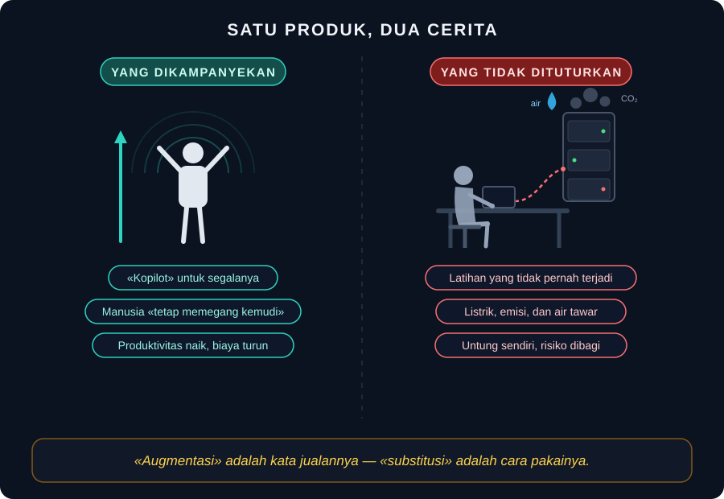

# Mitos Augmentasi

*Esai | Agustus 2026*

---

Pemimpin salah satu laboratorium AI terdepan pernah mengatakan — mungkin bercanda, mungkin tidak — bahwa kecerdasan buatan mungkin berujung pada kehancuran dunia, *tetapi sementara itu akan ada perusahaan-perusahaan hebat yang dibangun di atasnya*. Ruangan tertawa. Pasar juga tertawa, dengan cara sendiri: harga saham naik.

Coba bayangkan kalimat serupa keluar dari mulut eksekutif industri lain. Direktur penerbangan yang mengaku pesawatnya mungkin jatuh, tapi tiket tetap dijual hari ini. Presiden farmasi yang memperingatkan obatnya mungkin beracun, lalu mengundang dokter meningkatkan dosis. Kita akan menyebutnya skandal. Di industri AI, kalimat semacam itu disebut *kandidat*.

Di sinilah kita menemukan salah satu keanehan terbesar dalam sejarah perdagangan: **industri yang paling vokal memperingatkan bahayanya sendiri adalah industri yang tumbuh paling cepat menjualnya.** Para pemimpinnya bersaksi di parlemen tentang risiko kepunahan. Mereka mendirikan institusi keselamatan. Mereka menandatangani surat terbuka tentang "risiko kepunahan" — satu kalimat, ditandatangani ratusan eksekutif dan peneliti, dikeluarkan dengan pengumuman pers yang cermat. Lalu mereka kembali ke kantor dan melipatgandakan anggaran pelatihan model. Surat permintaan jeda enam bulan terbit dua minggu setelah model terkuat saat itu dirilis; pelatihan model berikutnya tidak pernah berhenti sehari pun.

Ada dua kemungkinan penjelasan. Pertama: mereka tidak percaya pada peringatannya sendiri — dan seisi surat itu adalah teater. Kedua: mereka percaya — dan tetap berlomba. Kedua penjelasan sama-sama membingungkan, dan justru karena itu keduanya menunjuk ke arah yang sama: pada sebuah cerita yang membuat keduanya menjadi mungkin. Cerita itu disebut *augmentasi*.

## Kata yang Dibeli dengan Mahal

*Augmentasi* berasal dari bahasa Latin *augmentare* — menambah, memperbesar. Kata ini dipilih tidak karena kebetulan kosakata, melainkan karena pekerjaan yang diberikan kepadanya: membedakan produk ini dari *otomatisasi*, kata yang jelek sejarahnya. Otomatisasi mengingatkan pada pabrik, PHK, dan lengan robot. Augmentasi mengingatkan pada kacamata: alat yang membuat manusia melihat lebih jauh tanpa menggantikan mata. Otomatisasi mengambil alih; augmentasi menambah daya. Otomatisasi menggantikan tukang; augmentasi menaikkan maestro.

Maka setiap peluncuran produk mengikuti liturgi yang sama: *kopilot*, bukan autopilot. *Asisten*, bukan pengganti. *Manusia tetap memegang kemudi.* Kata-kata ini bukan sekadar pemasaran; mereka adalah teologi. Mereka menawarkan pengampunan kepada pembeli: kamu tidak sedang menyerahkan pekerjaanmu, kamu sedang menjadi versi dirimu yang lebih kuat.

Pertanyaan yang tidak diajukan dalam upacara peluncuran: apakah cara pemakaiannya memang demikian?

Data pemakaian menyindir liturgi itu. Mayoritas permintaan ke asisten AI bukanlah "bantu saya berpikir lebih dalam" melainkan "kerjakan ini untuk saya" — tulis, ringkas, terjemahkan, selesaikan. Studi terhadap pengembang perangkat lunak berpengalaman menemukan sesuatu yang lebih menggigit lagi: ketika diberi akses ke alat AI, pekerjaan mereka justru melambat — sementara *perasaan* mereka tentang kecepatan sendiri justru meningkat. Studi lain, terhadap profesional bersertifikat, menemukan pola yang serupa: dengan bantuan AI, kualitas keputusan menurun, kepercayaan diri tidak. Kopilot yang dijanjikan berperilaku seperti autopilot di tangan penumpang — dan penumpangnya makin yakin bahwa dialah yang terbang.

Bahkan dalam catur — tempat mitos *manusia-plus-mesin* lahir — ceritanya punya tanggal kedaluwarsa yang jarang disebutkan. Setelah Kasparov kalah dari mesin, lahirlah catur "kentaur": grandmaster membawa mesin di tasnya, dan tim gabungan itu sempat mengalahkan mesin telanjang mana pun. Sepuluh tahun kemudian, mesin telanjang mengalahkan semua kentaur. Hybrid menang hanya di masa transisi — dan masa transisi selalu berakhir. Yang dijual industri sebagai tujuan akhir ternyata hanya jembatan; dan jembatan, sejarahnya menunjukkan, biasanya menuju ke satu arah.

## Anatomi Sebuah Mitos

Kenapa mitos ini bekerja begitu baik? Karena ia melakukan tiga hal sekaligus bagi penjualnya.

**Pertama, ia membelisensi pembeli.** Psikologi mengenalnya sebagai *moral licensing*: orang yang telah melakukan satu tindakan baik memberi dirinya izin untuk melakukan hal yang merugikan setelahnya. "Saya memakai AI secara bertanggung jawab, sebagai alat bantu" adalah kalimat yang, sekali diucapkan, membebaskan dari kewajiban memeriksa apakah alat itu benar-benar dipakai sebagai alat bantu. Mitos augmentasi menjual izin itu secara massal — dengan diskon pelanggan baru.

**Kedua, ia memindahkan risiko.** Perhatikan arah panahnya: keuntungan dari substitusi — biaya yang dihemat, produktivitas yang diklaim — mengalir ke pemilik model dan pemegang saham. Risikonya terdistribusi ke semua orang lain: pekerja junior yang tangganya dipotong dari tangga karier, komunitas yang airnya dipakai mendinginkan server, pembaca yang mengonsumsi teks tanpa tahu siapa yang menulis, spesies yang otot berpikirnya atrofi pelan-pelan. Dalam ekonomi, pola seperti ini punya nama yang tidak sopan: *privatisasi keuntungan, sosialisasi kerugian*. Dalam pemasaran, pola yang sama punya nama yang indah: augmentasi.

**Ketiga — dan ini yang paling halus — mitos ini membalik arah bukti.** Ketika hasilnya buruk, itu bukti augmentasi perlu lebih banyak AI. Ketika pekerja junior tidak berkembang, solusinya lebih banyak kopilot. Ketika pengguna tertunduk lelah di depan layar, itu tanda perlu asisten yang lebih proaktif. Sebuah cerita yang tidak bisa dibantah oleh bukti apa pun bukanlah ilmu dan bukan pemasaran — ia adalah iman. Dan iman, sepanjang sejarah, adalah produk dengan margin tertinggi yang pernah ada.

Ilustrasinya sederhana dan bisa digambar dalam satu bingkai: di sisi kiri, manusia berdiri dengan tangan terangkat, aura mengelilinginya, panah menunjuk ke atas — itulah yang dikampanyekan. Di sisi kanan, orang yang sama tertunduk di meja, laptopnya tersambung kabel putus-putus ke server yang berasap — itulah yang tidak dituturkan. Satu produk. Dua cerita. Hanya satu yang punya anggaran iklan.

## Pengakuan yang Dijadwalkan

Skeptis yang baik akan bertanya: bukankah mereka memang memperingatkan tentang risiko? Bukankah itu tanda kejujuran?

Mari kita periksa bentuk peringatan itu dengan teliti, karena bentuknya mencurigakan.

Peringatan yang dipilih adalah peringatan tentang *masa depan yang ekstrem*: kepunahan spesies, superkecerdasan, mesin yang memberontak. Semuanya nyata untuk diperdebatkan, tidak ada yang bisa diverifikasi hari ini, dan — ini bagian pentingnya — tidak ada satu pun yang mengharuskan mengubah apa pun pada produk hari ini. Bandingkan dengan risiko yang sudah terukur sekarang: atrofi kognitif pada pengguna berat, konsumsi listrik dan air data center, pemangkasan jenjang karier, banjir konten sintetis. Risiko-risiko ini punya angka, punya korban yang sudah ada, dan punya satu solusi sederhana: jual lebih sedikit, lebih lambat. Peringatan publik hampir tidak pernah menyentuhnya. Yang dipilih selalu risiko yang solusinya bukan "berhenti menjual" melainkan "biarkan kami, orang-orang paham, yang mengurusnya."

Perhatikan pula efek samping peringatan besar-besaran itu terhadap otak khalayak. Psikologi mengenal *mere exposure effect*: paparan berulang pada sebuah stimulus meningkatkan rasa nyaman terhadapnya. Setiap kali eksekutif bersaksi tentang "bahaya AI yang luar biasa", dua hal terjadi sekaligus: publik mendengar bahwa AI itu luar biasa, dan bahwa para ahlinya sedang mengawasinya. Ketakutan dan rasa aman dijual dalam satu paket. Industri rokok pernah menjual "light"; industri minyak pernah mempublikasikan risiko iklim sambil mengebor lebih dalam. Tidak ada yang baru di sini — kecuali skalanya: ini pertama kalinya sebuah industri menjadikan *kesadaran akan risikonya sendiri* sebagai bagian dari strategi pertumbuhan.

Dan ketika tekanan publik memuncak, responsnya selalu sama: komitmen, lembaga, kerangka kerja. "Keselamatan AI" — kata yang dalam praktiknya berfungsi ganda: bagi sebagian peneliti, ia adalah pekerjaan sungguhan; bagi laporan tahunan, ia adalah paragraf yang menenangkan investor. Surat jeda yang tidak menjeda. Standar yang menstandarkan apa yang sudah dilakukan. Audit yang mengaudit hal yang aman untuk diaudit. Sejarah akan mencatat ini dengan kalimat yang dingin: *mereka tahu, mereka bilang tahu, dan mereka tetap mengirimkannya.*

## Paradoks Energi

Tidak ada tempat mitos ini lebih telanjang daripada di persimpangan AI dan iklim.

Perusahaan-perusahaan yang paling lantang berkomitmen netral karbon sedang membangun gedung-gedung raksasa yang menelan listrik sebesar negara kecil. Laporan tahunan mereka menceritakan dua kisah dalam satu sampul: emisi yang *naik puluhan persen* karena data center, dan rencana *memperluas* data center. Air yang dipakai untuk mendinginkan server diukur dalam miliaran liter per tahun — dari wilayah yang kerap kekurangan air bersih. Satu pertanyaan ke model bahasa diperkirakan menelan energi belasan kali lipat dibanding satu pencarian web biasa. Dan pelatihan model generasi berikutnya selalu butuh lebih banyak dari generasi sebelumnya, dengan skala yang tidak lagi bisa dibayangkan sebagai "listrik rumah tangga beberapa kota" — melainkan persis begitu, hanya dengan lebih banyak kota.

Bagaimana cara industri ini menjawab paradoksnya? Dengan versi mitos yang sama, dinaikkan satu tingkat: *AI akan menyelesaikan masalah iklim.* Model yang sama yang mempercepat pencarian minyak, yang mengoptimalkan iklan yang menggerakkan konsumsi, akan — katanya — merancang material baru, memprediksi cuaca, dan menghemat jaringan listrik. Mungkin saja benar untuk sebagian kecil pemakaian. Tetapi perhatikan struktur kalimatnya: ia identik dengan "AI mengaugmentasi pekerja." Janji manfaat di masa depan membayar untuk ekspansi di masa kini, dan bukti biayanya ditunda sampai biaya itu menjadi warisan. Ini bukan analisis iklim. Ini cara bicara penjual: setiap mesin baru dijanjikan akan membayar untuk dirinya sendiri — dan mesin ini dijanjikan akan membayar untuk planet ini juga.

Ada nama yang lebih jujur untuk semua ini: bukan augmentasi, melainkan *eksternalitas* — biaya yang tidak masuk ke harga. Harga langganan bulanan tidak memuat liter air yang hilang, tidak memuat jam latihan yang tidak pernah terjadi pada jutaan otak, tidak memuat jenjang karier yang dipotong. Pembeli merasa membeli keajaiban murah karena memang sebagian harganya ditagihkan kepada pihak yang tidak ikut tanda tangan.

## Yang Akan Dikatakan Industri Ini

Sebelum menghakimi, dengarkan pembelaan terkuat mereka, karena pembelaan itu tidak bodoh.

*Pertama: teknologi ini benar-benar membantu banyak orang.* Benar. Dokter menemukan pola yang terlewat; penyandang disabilitas mendapat mata dan tangan tambahan; peneliti menyaring literatur dalam hitungan jam. Tapi perhatikan: pengakuan ini tidak membela mitosnya — ia membela alatnya. Kamu bisa sepenuhnya setuju bahwa obat itu menyembuhkan sambil menolak iklan yang mengatakan obat itu tanpa efek samping. Yang ditolak di sini bukan AI, melainkan *ceritanya*.

*Kedua: jika kami tidak yang membangun, yang lain yang membangun — lebih buruk.* Ini logika perlombaan senjata, dan logikanya pernah dipakai setiap industri yang pernah berbahaya. Perhatikan saja apa yang dilakukan argumen ini pada pertanggungjawaban: ia menghapusnya. Tidak ada lagi keputusan, hanya medan lomba. Padahal "kalau bukan kami, orang lain" adalah kalimat yang bisa diucapkan siapa pun untuk apa pun — dan sejarah tidak pernah menerimanya sebagai pembenaran, hanya sebagai deskripsi.

*Ketiga: pasar yang akan mengoreksi.* Pasar memang mengoreksi — dengan kecepatan yang cocok untuk pasar. Kerusakan kognitif tidak muncul di kuartal ini; kelelahan akuifer tidak muncul di kuartal ini; generasi yang tidak terlatih baru terasa di dekade berikutnya, ketika orang-orang yang memotong tangganya sudah pensiun dengan hasil investasinya. Pasar sangat pandai menghargai risiko yang jatuhnya di masa depan — ia menyebutnya diskonto.

Tiga pembelaan ini, dengan kata lain, bukan jawaban. Mereka adalah versi yang lebih sopan dari kalimat yang tadi kita dengar di pembuka: *mungkin berbahaya, tapi bisnisnya hebat.*

## Apa yang Bisa Dilakukan Orang Awam

Mitos tidak runtuh oleh ceramah; ia runtuh oleh pertanyaan yang tidak bisa dijawabnya. Beberapa pertanyaan itu bisa dibawa oleh siapa saja ke meja penjualan:

**Tanya rasionya, bukan kemampuannya.** Setiap kali mendengar "AI meningkatkan produktivitas X%", tanya: diukur dengan apa, pada siapa, dan berapa yang hilang di sisi lain? Studi yang hanya mengukur kecepatan output tanpa mengukur apa yang terjadi pada kemampuan orangnya bukan studi augmentasi — ia brosur yang panjang.

**Tanya siapa yang memakai, bukan siapa yang menjual.** Perusahaan yang sama yang menaruh AI di setiap meja kerja adalah perusahaan yang melarang anak-anaknya — anak-anak sungguhan, yang sekolahnya dibiayai eksekutifnya — memakainya tanpa batas. Ikuti perilaku orang dalam, bukan pidatonya. Itu selalu sinyal yang lebih jujur.

**Tanya harga penuhnya.** Listrik, air, jenjang latihan yang hilang, ketergantungan yang menumpuk. Kalau sebuah produk hanya terjangkau karena sebagian harganya ditagihkan kepada orang yang tidak memakainya, maka yang sedang kamu beli bukanlah efisiensi — melainkan utang.

**Dan di skala pribadi, terapkan uji yang sama dengan yang kita pakai untuk membedakan pelatih dari kursi roda:** apakah alat ini, setelah setahun, membuatku lebih mampu — atau lebih bergantung? Jawabannya jarang berupa hitam-putih, dan tidak perlu. Cukup pastikan arah panahnya. Augmentasi yang jujur meninggalkan manusia yang lebih besar. Substitusi yang menyamar meninggalkan manusia yang lebih ringan — dalam arti yang paling tidak menyenangkan dari kata itu.

## Penutup: Yang Dijual Adalah Ceritanya

Prometheus, dalam mitos Yunani, mencuri api untuk manusia dan dihukum oleh para dewa. Dalam versi yang diceritakan ulang di ruang-rang rapat Silicon Valley, Prometheus adalah pahlawan yang disiksa dewa-dewa yang iri — dan bagian hukumannya sengaja dipotong. Padahal justru di situ letak kebijannya: mitos aslinya tidak bertanya apakah api itu berguna. Tentu berguna. Ia bertanya siapa yang menanggung hukumannya.

Pertanyaan yang sama harus kita ajukan sekarang, karena industri ini menjual dua produk sekaligus: model di satu sisi, dan cerita tentang model di sisi lain. Modelnya nyata — kadang menakjubkan, layak dipakai, layak diperjuangkan untuk orang-orang yang selama ini tidak punya akses. Tetapi ceritanya — bahwa ia hanya menambah, tidak mengurangi; bahwa risikonya hanya ada di masa depan; bahwa yang mengurus risiko adalah orang yang sama yang menghasilkannya — cerita ini adalah produk yang tidak pernah diuji, dan harganya sedang dibayar dengan mata uang yang tidak tercatat di laporan keuangan mana pun: otot berpikir sebuah spesies, air dan langit yang meminjaminya, dan waktu satu generasi yang tidak akan pernah bisa diminta kembali.

Maka kalau ada satu kalimat yang layak diukir di pintu masuk era ini, mungkin begini:

**Augmentasi bukanlah fakta yang dijanjikan oleh penjualnya. Augmentasi adalah hasil yang harus dibuktikan oleh pemakainya — dan selama buktinya tidak diminta, yang dijual bukanlah kekuatan tambahan, melainkan cerita yang membuat penyerahan diri terasa seperti pemberdayaan.**

Dewa-dewa Yunani setidaknya jujur soal hukuman.

Penjual api hari ini menyebutnya *roadmap*.

---

*Karya ini ditulis dengan bantuan AI dan disunting manusia.*
