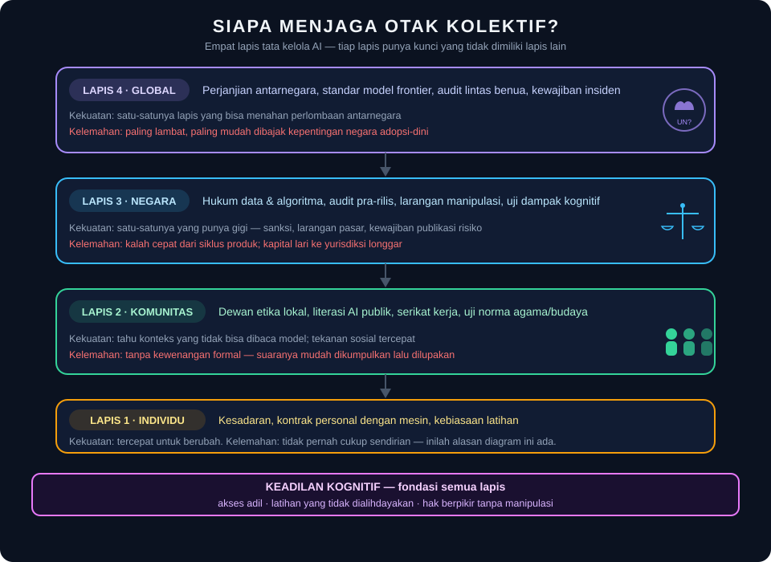

# Siapa Menjaga Otak Kolektif?

*Esai | Agustus 2026*

---

Esai-esai sebelumnya berhenti di ambang pintu individu: bagaimana satu orang menjaga otaknya sendiri dari kenyamanan yang melumpuhkan. Pintu itu penting — tapi ada batas yang tidak bisa dilampaui kebiasaan pribadi. Satu orang bisa memutuskan untuk tetap menulis dengan tangannya. Ia tidak bisa, seorang diri, memutuskan bahwa anak-anak sekampungnya tidak tumbuh menjadi generasi yang tidak pernah belajar berpikir tanpa bantuan mesin.

Di sinilah pertanyaannya harus naik tingkat. Bukan lagi "bagaimana saya memakai AI dengan benar", melainkan **"siapa yang mengatur pemakaian semua orang — dan atas nama apa?"** Pertanyaan ini menyentuh empat lapis kehidupan bersama: komunitas, masyarakat, negara, dan dunia. Setiap lapis punya alat yang tidak dimiliki lapis lain — dan setiap lapis punya cara gagal yang khas. Esai ini memetakan keduanya, lalu berhenti pada satu fondasi yang jarang disebut dalam dokumen tata kelola mana pun: **keadilan kognitif.**

## Lapis Individu: Penting tapi Tidak Cukup

Mulai dari lapis yang sudah dibahas, supaya jelas posisinya.

Kesadaran individu adalah lapis tercepat: ia bisa berubah malam ini juga, tanpa rapat, tanpa regulasi, tanpa anggaran. Kontrak personal dengan mesin — draf pertama milikmu, uji pemahaman setelah membaca penjelasan, satu domain yang tidak pernah dialihdayakan — semuanya valid dan sudah dibahas panjang.

Tapi lapis individu punya cacat struktural yang membuatnya mustahil dijadikan solusi utama. **Ia bertumpu pada kehendak bebas yang justru sedang menjadi objek persaingan bisnis.** Meminta miliaran orang secara individual menahan diri dari produk yang dirancang oleh ribuan insinyur terbaik dunia untuk tidak ditolak — itu bukan strategi; itu doa. Kita sudah pernah menjalani eksperimen ini dengan media sosial: sepuluh tahun kampanye "gunakan dengan bijak" menghasilkan... sepuluh tahun kampanye. Masalahnya bukan niat orang-orangnya. Masalahnya adalah lingkungan pilihan yang dibangun oleh pihak lain. Maka kesadaran individu adalah *syarat* — bukan jawaban. Ia fondasi tempat lapis-lapis di atasnya berdiri, dan seperti semua fondasi: ia menopang, ia tidak membangun.

## Lapis Komunitas: Tercepat, Tapi Tanpa Gigi

Naik satu tingkat: komunitas dan masyarakat sipil.

Inilah lapis yang paling sering diremehkan padahal paling dekat dengan manusia sungguhan. Dewan etika kampung yang memutuskan AI tidak boleh dipakai untuk surat permohonan kerja warga. Asosiasi guru yang menuntut standar tugas di era model bahasa. Serikat pekerja yang bernegosiasi bahwa alat evaluasi AI tidak boleh jadi hakim tunggal PHK. Kelompok agama yang menguji rekomendasi mesin terhadap norma yang hidup lebih lama dari silikon. Forum orang tua sekolah yang menulis piagam pemakaian sendiri ketika pemerintah masih sibuk dengan peta jalan nasional.

Kekuatan lapis komunitas terletak pada sesuatu yang tidak dimiliki laboratorium mana pun: **pengetahuan konteks**. Model bahasa tahu statistik tentang sebuah desa; tokoh adat tahu desanya. Algoritma bisa mendeteksi pola kekerasan dalam rumah tangga dari data; relawan sosial tahu mengapa korban diam. Tata kelola yang dilepaskan dari konteks ini akan menghasilkan aturan yang rapi di kertas dan mati di lapangan — atau lebih buruk: aturan yang bekerja sempurna untuk kota besar dan menghancurkan yang lemah.

Kelemahannya sama nyatanya: **komunitas punya suara tanpa gigi.** Ia bisa menegur, merekomendasikan, memperingatkan — tapi tidak bisa melarang. Dan industri digital sudah menguasai seni menyerap tekanan sosial: bentuk konsultan, dengar keluhan, buat dewan penasihat, publikasikan komitmen, lanjutkan peluncuran. Satu-satunya cara lapis komunitas tidak menjadi hiasan adalah kalau ia tersambung ke lapis yang punya gigi — negara. Hubungan simbiosis ini, bukan kemurnian otonom, yang membuat gerakan sipil berhasil di sejarah: suara memberi arah, hukum memberi daya.

Ada pula risiko yang jarang diakui oleh kaum aktivis: **komunitas bisa salah.** Tekanan sosial lokal bisa melarang AI justru di tempat ia paling dibutuhkan — klinik desa tanpa dokter, siswa dyslexia tanpa tutor. Tata kelola dari bawah butuh rem yang sama dengan tata kelola dari atas: uji dampak, keterbukaan, dan kesediaan mengubah pendapat ketika bukti berbicara.

## Lapis Negara: Satu-satunya yang Punya Gigi

Sekarang masuk ke aktor yang paling banyak dibicarakan dan paling sering disalahpahami.

Negara adalah satu-satunya entitas dalam diagram ini yang bisa melarang, mewajibkan, dan menghukum. Semua instrumen klasik tata kelola akhirnya bermuara ke sana: hukum perlindungan data, kewajiban audit algoritma sebelum rilis, larangan praktik manipulatif (dark patterns, targeting rentan, profil politik rahasia), standar transparansi label konten sintetis, kewajiban pelaporan insiden. Beberapa yurisdiksi sudah mulai: Eropa memilih jalan regulasi komprehensif berbasis tingkat risiko; Amerika memilih jalan per-sektor dan biarkan pasar dulu; sebagian besar negara berkembang memilih... menunggu, biasanya sampai insiden datang membawa nama mereka.

Yang jarang didiskusikan secara jujur adalah **apa arti regulasi AI bagi negara berkembang** — karena dinamikanya berbeda dari buku teks yang ditulis di Brussels.

Pertama, asimetri posisi tawar. Ketika pasar terbesarmu adalah konsumen dan kapital terbesarmu adalah asing, ancaman "industri akan pergi" adalah senjata lobi yang selalu tajam. Regulasi apa pun akan dihadang argumen yang sama: jangan bunuh inovasi — dan di negara yang lapangan kerjanya langka, argumen itu menakutkan secara sah.

Kedua, jebakan kapasitas. Mengaudit model bahasa butuh orang yang paham model bahasa — yang gajinya di pasaran global jauh di atas gaji aparatur. Negara bisa menuliskan kewajiban audit di undang-undang dan tetap tidak punya siapa pun yang mampu melakukannya. Regulasi tanpa kapasitas menghasilkan dua pilihan yang sama-sama buruk: formalitas (audit kertas yang lolos semuanya) atau ketergantungan pada auditor swasta yang dibayar oleh industri yang diauditinya.

Ketiga — dan ini spesifik untuk bangsa yang baru merdeka beberapa dekade: **regulasi AI adalah soal kedaulatan yang menyamar sebagai soal teknis.** Negara yang tidak punya model, tidak punya pusat data, dan tidak punya standar sendiri tidak sedang "menunggu teknologi matang". Ia sedang meminjamkan proses pengambilan keputusan kognitif warganya ke yurisdiksi lain, dengan syarat dan ketentuan yang berlaku. Sejarah kolonial punya banyak bab tentang eksploitasi tambang dan lahan; bab yang belum ditulis adalah tentang eksploitasi perhatian dan pikiran — diambil mentah, diolah di luar negeri, dikembalikan sebagai produk jadi yang harus dibeli.

Lalu apa bentuk tata kelola negara yang masuk akal? Bukan larangan total — itu hanya mengalihkan pasar ke gelap. Bukan juga imitasi Eropa mentah-mentah — konteksnya beda, kapasitasnya beda. Bentuk yang paling realistis untuk negara dengan sumber daya menengah mungkin lebih sederhana daripada yang dibayangkan para legislator: **wajibkan transparansi, bukan kepatuhan.** Model yang dipakai layanan publik harus diumumkan. Keputusan yang mengubah hidup (beasiswa, kredit, layanan kesehatan) harus punya jalur banding ke manusia. Insiden besar harus dilaporkan, seperti kebocoran data. Konten sintetis harus berlabel. Empat hal ini tidak butuh supercomputer regulator — cukup hukum yang jelas dan keberanian menegakkannya sekali atau dua kali secara publik.

Dan di atas semua itu ada satu kewajiban yang hampir tak pernah masuk rancangan undang-undang mana pun: **uji dampak kognitif.** Negara menguji dampak obat terhadap tubuh sebelum dijual; tidak ada negara yang menguji dampak produk terhadap kemampuan berpikir penggunanya sebelum diedarkan ke remaja. Padahal metodenya tidak mistis: studi longitudinal sederhana pada kelompok pengguna berat vs terkontrol. Kalau hasilnya menunjukkan atrofi — setidaknya kita tahu, dan kebijakan bisa bicara dengan data, bukan panik.

## Lapis Global: Meja yang Belum Ada

Lapis paling atas dan paling rapuh: tata kelola lintas negara.

Masalah yang dimiliki lapis ini fundamental: **fenomena yang diaturnya bersifat transnasional, sementara kewenangannya tetap nasional.** Model dilatih di satu benua, dihosting di benua kedua, dipakai di benua ketiga, dan merusak pemilu di benua keempat. Tidak ada polisi yang punya yurisdiksi mengikuti paket datanya. Upaya-upaya ada — prinsip-prinsip UNESCO, summit keselamatan AI, draf perjanjian dewan Eropa — tapi semuanya masih bertingkah laku seperti diplomasi iklim: deklarasi megah, mekanisme lemah, dan keberanian yang mundur setiap kali kompetisi geopolitik mengetuk pintu. Dan kompetisi itu selalu mengetuk. Selama ada negara yang percaya memenangkan perlombaan AI lebih penting daripada menjaga dunia dari perlombaan itu sendiri, perjanjian global akan terus berhenti di kata-kata yang aman.

Apakah berarti lapis global sia-sia? Tidak — tapi kekuatannya bukan pada perjanjian besar yang fotogenik. Ia pada hal-hal yang kurang televise: standardisasi teknis (format pelaporan insiden, protokol audit yang bisa saling dikenali antarnegara), kewajiban insiden lintas batas (seperti yang akhirnya tumbuh di dunia penerbangan setelah tabrakan udara), dan rezim informasi bersama antar-regulator. Penerbangan sipil membuktikan bahwa industri yang membunuh orang lintas benua bisa dipaksa berbagi data keselamatan dengan pesaingnya — tapi butuh bencana besar untuk memulainya. Pertanyaannya bukan apakah AI butuh versi ICAO-nya sendiri. Pertanyaannya: bencana seberapa besar yang akan membelinya.

Dan di sinilah negara-negara seperti Indonesia punya peran yang tidak dimiliki blok adopsi-dini: **suara mayoritas dunia yang belum terikat kepentingan.** Blok negara berkembang secara kolektif adalah pasar terbesar dan korban potensial terbesar dari tata kelola yang buruk — posisi moral yang belum pernah dipakai secara serius di meja global. Selama mereka hanya menunggu aturan dari yang lain, aturan yang lahir pasti aturan pembeli. 

## Fondasi yang Tak Pernyataan Resmi Sebut: Keadilan Kognitif

Semua lapis di atas berdiri di atas satu konsep yang belum punya nama resmi dalam dokumen tata kelola mana pun — dan justru karena itu perlu dinamai di sini.

Keadilan distribusi sudah dikenal: siapa yang dapat barang. Keadilan prosedural sudah dikenal: siapa yang ikut memutuskan. **Keadilan kognitif adalah yang ketiga: siapa yang berhak mempertahankan kapasitas berpikirnya — dan siapa yang boleh memonopoli alat-alatnya.**

Ia punya minimal tiga komponen konkret. *Akses*: jika AI benar-benar menjadi infrastruktur kognitif — seperti listrik dan internet dulu — maka jurang aksesnya adalah jurang kemampuan hidup, dan harus diperlakukan seperti jurang listrik: masalah publik, bukan nasib pasar. *Latihan*: setiap warga berhak pada pendidikan yang tetap melatih otot berpikirnya meski mesin tersedia gratis — sekolah yang menyerahkan proses berpikir kepada alat telah menggelapkan hak yang bukan miliknya. *Integritas*: hak untuk tidak dimanipulasi — tidak diarahkan preferensinya oleh sistem yang lebih tahu tombol-tombol psikologismu daripada dirimu sendiri. Dua komponen pertama tentang memberi; yang ketiga tentang melindungi.

Keadilan kognitif berbeda dari literasi digital. Literasi mengajari cara memakai alat; keadilan bertanya siapa yang boleh memiliki alat, siapa yang boleh mengatur, dan apa yang tidak boleh dijual. Negara yang hanya mengajarkan warganya menggunakan AI tanpa memberi mereka hak atas relasi dengan AI sedang mendidik pengguna — bukan warga.

Dan di titik ini semua lapis bertemu. Individu menjaga latihannya sendiri. Komunitas menjaga konteks dan norma. Negara menjaga akses, integritas, dan penegakan. Dunia menjaga agar perlombaan tidak membongkar semuanya. Empat lapis, satu fondasi — dan kegagalan salah satu lapis tidak bisa digantikan penuh oleh lapis lain. Itulah kesimpulan strukturalnya: **tata kelola AI bukan proyek dengan satu pemilik. Ia adalah jaring pengaman dengan banyak simpul — dan setiap simpul yang kosong akan dicari oleh beban.**

## Penutup: Generasi Perancis

Setiap infrastruktur besar pernah melalui fase yang sama: masa ketika ia begitu baru sehingga tidak diatur, begitu menguntungkan sehingga tidak mau diatur, dan begitu cepat sehingga pengaturan selalu datang setelah fakta. Mobil butuh puluhan tahun sebelum sabuk pengaman wajib. Rokok butuh setengah abad perang hukumnya. Media sosial — masih berlangsung.

AI memperpendek semua siklus itu, termasuk sayangnya siklus regulasinya. Maka generasi yang hidup sekarang — kita — berdiri di posisi yang jarang dialami umat manusia: **generasi perancis**, yang masih bisa memilih bentuk pagar sebelum kota dibangun, bukan sekadar menempelkan plakat peringatan di gedung-gedung yang sudah jatuh.

Pagar yang dibicarakan esai ini bukan satu tembok, melainkan jaring: kebiasaan pribadi yang menjaga latihan, komunitas yang menjaga konteks, negara yang menjaga aturan main dan giginya, dunia yang menjaga agar perlombaannya tidak membunuh semua yang dijaga. Dan di dasarnya, satu prinsip yang belum masuk naskah undang-undang mana pun tapi kelak pasti masuk — pertanyaannya hanya apakah lebih awal atau setelah mahal:

**Kemampuan berpikir adalah milik warga, bukan fitur yang disewakan.**

Semua tata kelola pada akhirnya hanyalah perpanjangan dari satu keputusan sederhana itu — diputuskan berulang-ulang, oleh banyak tangan, di banyak lapis, sebelum opsi menentukan habis.

---

*Karya ini ditulis dengan bantuan AI dan disunting manusia.*
