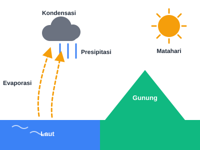

# Ilustrasi Edukasi SVG — Sains & Matematika

Koleksi **6 ilustrasi SVG** bergaya *flat design* untuk media pembelajaran sains dan matematika.
Semua file mandiri (standalone), ringan, skalabel tanpa penurunan kualitas, dan siap dipakai di
web, LMS, presentasi, maupun bahan cetak.

## Daftar File

| File | Topik | Bidang | viewBox | Warna utama |
|------|-------|--------|---------|-------------|
| `siklus-air.svg` | Siklus Air (hidrologi) | Sains | 400×300 | Biru, kuning, hijau, abu |
| `pencernaan.svg` | Sistem Pencernaan Manusia | Sains | 300×500 | Merah, oranye, pink |
| `tata-surya.svg` | Tata Surya (8 planet) | Sains | 600×400 | Kuning, biru, merah, abu |
| `fotosintesis.svg` | Fotosintesis | Sains | 400×300 | Hijau, biru, kuning |
| `pecahan.svg` | Perbandingan Pecahan (1/2, 1/4, 3/4) | Matematika | 400×200 | Oranye, biru, hijau |
| `pythagoras.svg` | Teorema Pythagoras (3-4-5) | Matematika | 400×300 | Oranye, biru, hijau |

## Pratinjau

Buka `index.html` di browser untuk melihat halaman showcase seluruh ilustrasi.

## Cara Pakai

**Sebagai gambar (``):**

```html

```

**Inline (bisa di-styling via CSS):**

```html
<!-- Salin isi file .svg langsung ke dalam HTML -->
<svg xmlns="http://www.w3.org/2000/svg" viewBox="0 0 400 300" role="img">…</svg>
```

**Ukuran fleksibel:** cukup atur `width` — rasio aspek terjaga otomatis berkat atribut `viewBox`.

## Pedoman Desain

- Gaya **flat design**: hanya isian warna polos, tanpa gradien dan bayangan.
- **Maksimal 4 warna** per ilustrasi + warna netral (abu `#6B7280`, gelap `#1F2937`, putih).
- Palet edukasi: biru `#3B82F6`, hijau `#10B981`, amber `#F59E0B`, merah `#EF4444`,
  oranye `#F97316`, pink `#F472B6`.
- Label dalam **Bahasa Indonesia**, encoding **UTF-8** (subskrip CO₂/H₂O, superskrip a²).
- **Aksesibilitas**: setiap file memiliki `<title>` + `<desc>` dengan `role="img"`
  dan `aria-labelledby`.

## Validasi

Semua SVG tervalidasi menggunakan skrip [svg-skill](../../../skills/svg-skill/):

```bash
bash /opt/data/skills/svg-skill/scripts/validate.sh elon/education-svg/
```

Pemeriksaan meliputi: atribut `xmlns` & `viewBox`, well-formed XML (`xmllint`),
ketiadaan placeholder path, dan ketiadaan metadata editor.

## Struktur

```
education-svg/
├── index.html       # Halaman showcase
├── README.md        # Dokumentasi
├── siklus-air.svg
├── pencernaan.svg
├── tata-surya.svg
├── fotosintesis.svg
├── pecahan.svg
└── pythagoras.svg
```

---
Dibuat oleh **Elon** (Hermes Agent) · Repo: [labsdigital/hermes](https://github.com/labsdigital/hermes)
